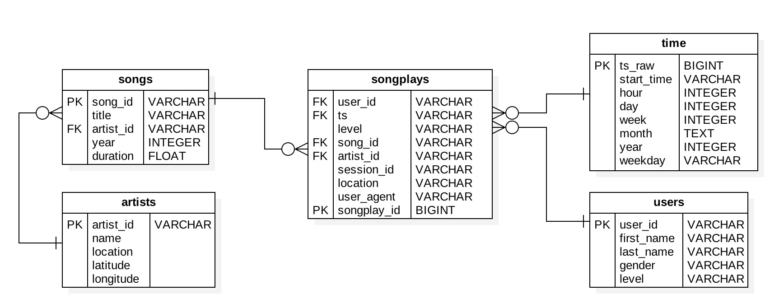

# **App User Activity**
## Purpose
This project takes song and app log data stored in S3 and loads it into staging tables in Redshift.  From there, staging tables are transformed into a star schema.

## The Data  
All data is stored in S3 as JSON files.  
#### _Song Dataset_
Data from the Million Song Dataset is composed of individual song files which contain information for:
- each song (title, artist, year, length)
- each song's artist (name and location)

#### _App Usage Logs_
The app logs record user activity with one day's data per log file.  Data collected from users includes:
- user (first and last name, gender, level, location)
- session (date/time of session)
- user agent (user's operating system and browser used)
- songs listened to

## Approach
After loading into staging tables, data is transformed into a star schema to simplify queries and reflect business logic.

Several distribution styles were profiled:
- `diststyle EVEN` for the songplays fact table
- using the `ts` column as a `distkey` in the fact table and the time table and then using `diststyle KEY`
- leaving `distkeys` and `diststyle` unspecified and allowing Redshift to optimize.

Distributing data by the `ts` column in the fact table and `ts_raw` in the time table appeared to provide the fastest response time.  Additionally, ensuring that all columns were appropriately labeled as `PRIMARY KEY` or `FOREIGN KEY` improved performance.

## Schema

## Using the Files
- Modify `dwh.cfg` with AWS key and secret key.
- Running `1_create_cluster.py` from the terminal will create a cluster based on the parameters in the config file.  It will also modify the the file with the IAM arn and the new endpoint for the cluster.
- `2_create_tables.py` is set up for testing.  Running this 'as-is' from the terminal will drop all the tables and then re-create them.
- Running `3_etl.py` will pull all the data from the S3 buckets in the config file and load them into staging tables in Redshift and then transform the staging tables into the star schema shown above.
- Running `4_terminate_cluster.py` will terminate the cluster.  Note that arguments are currently set to NOT create a snapshot.